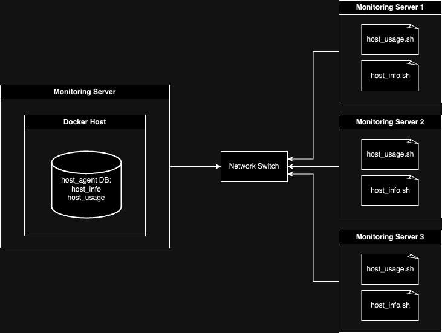

# Linux Cluster Monitoring Agent
## Introduction
This project provides real-time visibility into server hardware utilization, assuring peak performance and rapid issue resolution. It functions through a scheduled bash script triggered periodically by a crontab, recording data in a centralized SQL server hosted on Docker. This innovative approach enables continuous, minute-by-minute monitoring of server health and resource allocation. Highly esteemed by system administrators, this Linux cluster monitoring application guarantees uninterrupted server operations, preemptive troubleshooting, and resource allocation efficiency. With seamless integration and automated data collection, it serves as an indispensable tool for sustaining server uptime, optimizing performance, and aligning seamlessly with the dynamic needs of modern IT environments.

## Quick Start
- Start Docker on the server or PC where the centralized SQL server is hosted.
- Start a psql instance using `psql_docker.sh` by running `bash psql_docker.sh start ${db_username} ${db_password}`.
- Create host_info and host_usage tables using `ddl.sql`.
- Insert hardware specs data into the database using `host_info.sh` when initializing a new server.
- Insert hardware usage data into the database using `host_usage.sh` by setting up a cronjob in the desired schedule, such as `* * * * *` for every minute.

## Implementation

### Architecture


### Scripts
- `psql_docker.sh` (Start Postgresql on Docker)
- `host_info.sh` (Insert hardware specs data into DB)
- `host_usage.sh` (Insert hardware usage data into DB)
- `crontab` (Trigger `host_usage.sh` regularly)

### Database Modeling
#### `host_info`

| Column Name       | Data Type  | Constraints       | Description             |
| ----------------- | ---------- | ----------------- | ----------------------- |
| id                | SERIAL     | NOT NULL          | Unique identifier       |
| hostname          | VARCHAR    | NOT NULL          | Hostname of the server  |
| cpu_number        | INT2       | NOT NULL          | Number of CPUs          |
| cpu_architecture  | VARCHAR    | NOT NULL          | CPU architecture        |
| cpu_model         | VARCHAR    | NOT NULL          | CPU model               |
| cpu_mhz           | FLOAT8     | NOT NULL          | CPU speed (MHz)         |
| l2_cache          | INT4       | NOT NULL          | L2 Cache size           |
| timestamp         | TIMESTAMP  | NULL              | Timestamp (nullable)    |
| total_mem         | INT4       | NULL              | Total memory (nullable) |

#### `host_usage`

| Column Name     | Data Type  | Constraints              | Description            |
| --------------- | ---------- | ------------------------ | ---------------------- |
| timestamp       | TIMESTAMP  | NOT NULL                 | Timestamp               |
| host_id         | SERIAL     | NOT NULL                 | Host ID (Foreign Key)   |
| memory_free     | INT4       | NOT NULL                 | Free Memory             |
| cpu_idle        | INT2       | NOT NULL                 | CPU Idle Percentage     |
| cpu_kernel      | INT2       | NOT NULL                 | CPU Kernel Percentage   |
| disk_io         | INT4       | NOT NULL                 | Disk I/O                |
| disk_available  | INT4       | NOT NULL                 | Available Disk Space   |


## Test

To verify the functionality of the project, follow these steps:

1. **Create PostgreSQL Docker Container**:
    - Run the following command to create a new PostgreSQL server using Docker:
      ```bash
      bash psql_docker.sh create ${psql_user} ${psql_password}
      ```
    - Then, execute `docker ps` to check if a new PostgreSQL container has been created.

2. **Create Database Tables**:
    - Use the following command to create the necessary database tables (`host_info` and `host_usage`):
      ```bash
      psql -U ${psql_user} -d host_agent -f sql/ddl.sql
      ```
    - Confirm that the tables have been created successfully.

3. **Insert Data into `host_info`**:
    - Run the following command to insert a new record into the `host_info` table:
      ```bash
      bash host_info.sh ${psql_host} ${psql_port} host_agent ${psql_user} ${psql_password}
      ```
    - Check if the new record has been added to the `host_info` table.

4. **Insert Data into `host_usage`**:
    - Execute the following command to insert a new record into the `host_usage` table:
      ```bash
      bash host_usage.sh ${psql_host} ${psql_port} host_agent ${psql_user} ${psql_password}
      ```
    - Verify if the new record has been successfully added to the `host_usage` table.

These tests will help ensure that the project's components are functioning as expected. Be sure to replace `${psql_host}`, `${psql_port}`, `${psql_user}`, and `${psql_password}` with your specific PostgreSQL database configuration. Default `${psql_host} and ${psql_port} would be localhost and 5432 respectively.

## Deployment

### On the Central Monitoring Server:

1. **Pull Code from GitHub**:
   - Retrieve the latest code from this GitHub repository.

2. **Ensure Docker is Running**:
   - Ensure that Docker is running on the central monitoring server. If not, you can install Docker.

3. **Install PostgreSQL**:
   - Run the following command to install PostgreSQL with your desired username and password:
     ```bash
     bash psql_docker.sh create ${psql_user} ${psql_password}
     ```

4. **Initialize the Database**:
   - Initialize the database by executing the SQL script to create tables:
     ```bash
     psql -U ${psql_user} -d host_agent -f sql/ddl.sql
     ```

### On Slave Servers:

1. **Pull Code from GitHub**:
   - Obtain the latest code from this GitHub repository again.

2. **Collect and Insert Server Information**:
   - Run the following command on each slave server, replacing placeholders with appropriate values:
     ```bash
     bash host_info.sh ${psql_host} ${psql_port} host_agent ${psql_user} ${psql_password}
     ```
     This command collects and inserts server information into the central database.

3. **Set Up Cronjob for `host_usage`**:
   - Configure a new cronjob to trigger the `host_usage` script at regular intervals. For example, to run it every minute, add the following line to your crontab:
     ```bash
     * * * * * bash ${full_path_of_host_usage_file} ${psql_host} ${psql_port} host_agent ${psql_user} ${psql_password} >> ${full_path_of_log_file}
     ```
     Ensure that you replace placeholders with the appropriate paths and values.

These deployment steps enable you to set up the monitoring system on both the central monitoring server and slave servers, ensuring accurate data collection and regular updates.


## Improvements

To streamline server setup and management, create a bash script for automated cronjob creation. Include this script, along with `host_info.sh`, in the server's startup script to automate the initiation process when scaling out servers.

### Cronjob Automation

Develop a bash script to automate cronjob creation.

### Startup Script Integration

Incorporate the following steps into the server's startup script:

1. Execute the Cronjob Automation Script to set up scheduled tasks upon server launch.

2. Run `host_info.sh` with the necessary parameters to collect and insert system information into the database, populating the `host_info` table.

These enhancements simplify server initialization and improve the management of the server fleet, reducing manual configuration efforts and ensuring infrastructure consistency.
